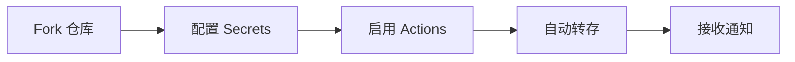

<!-- markdownlint-disable MD033 MD041 -->
<div align="center">

# 🚀 百度网盘自动转存 GitHub Actions

**基于 GitHub Actions 的百度网盘自动转存工具，每两小时自动执行转存任务**

[](https://www.python.org/)
[](https://github.com/features/actions)
[](LICENSE)
[](https://github.com/your-username/baidu-transfer-action/actions)

</div>

## 🌟 项目亮点

<div align="center">

| 特性 | 描述 |
|------|------|
| 🤖 **自动化** | 每两小时自动执行转存任务 |
| 🔐 **密码支持** | 完美支持带密码的分享链接 |
| 📦 **批量处理** | 一次性转存多个分享链接 |
| 📁 **灵活保存** | 可为每个链接指定保存目录 |
| 🧠 **智能去重** | 自动跳过已存在的文件 |
| 📊 **进度跟踪** | 实时查看转存进度和结果 |
| 📱 **即时通知** | 企业微信机器人实时通知 |

</div>

## 📚 目录

<details>
<summary>点击展开目录</summary>

- [✨ 快速开始](#-快速开始)
- [🔧 环境准备](#-环境准备)
- [⚙️ 详细配置](#️-详细配置)
- [▶️ 使用方法](#️-使用方法)
- [🔗 链接格式](#-分享链接格式说明)
- [🛠 故障排除](#-故障排除)
- [⚠️ 注意事项](#️-注意事项)
- [📄 许可证](#-许可证)
- [🤝 贡献](#-贡献)

</details>

## ✨ 快速开始

只需简单几步，即可开始自动转存百度网盘文件：



## 🔧 环境准备

### 使用脚本一键获取 Cookies 并可选写入 Secrets（推荐）

脚本：`save_baidu_cookies.py` — 通过真实浏览器登录百度网盘，自动提取 Cookie，并可写入本地 env 文件或 GitHub Secrets。

先决条件：
- pip install playwright
- python -m playwright install
- 写入 Secrets 需要 GitHub CLI：brew install gh && gh auth login

常用用法：

```bash
# 1) 获取并写入 GitHub Secrets（会弹出浏览器扫码/登录）
python save_baidu_cookies.py --repo owner/repo

# 2) 仅获取并写入本地 env（默认 baidu_cookies.env）
python save_baidu_cookies.py

# 3) 从已有 env 写入 Secrets（不启浏览器）
python save_baidu_cookies.py --repo owner/repo --from-env --env baidu_cookies.env

# 4) 只写最小或全量 Secrets（与 --repo 搭配使用）
python save_baidu_cookies.py --repo owner/repo --min-only
python save_baidu_cookies.py --repo owner/repo --full-only

# 5) 无头模式（不推荐，扫码不便）
python save_baidu_cookies.py --headless
```

脚本行为说明：
- 最小必需变量 BAIDU_COOKIES：仅包含 BDUSS 与 STOKEN，格式 `BDUSS=...; STOKEN=...`
- 全量变量 BAIDU_COOKIES_FULL：将全部 Cookie 合并（优先 pan.baidu.com 域），格式 `name=value; name2=value2`
- 默认会将抓取结果写入本地 `baidu_cookies.env`，可配合 `--from-env` 再写入 Secrets

安全提示：
- Cookie 含敏感信息，请妥善保管，不要提交到仓库
- 建议优先使用扫码登录并在完成后尽快关闭浏览器

### 1. Fork 仓库

点击右上角的 **"Fork"** 按钮，将此仓库复制到您的 GitHub 账户。

### 2. 获取百度网盘 Cookies

1. 登录 [百度网盘网页版](https://pan.baidu.com)
2. 按 `F12` 打开开发者工具
3. 进入 `Application` → `Cookies` → `https://pan.baidu.com`
4. 找到 `BDUSS` 和 `STOKEN` 的值
5. 按格式组合：`BDUSS=xxx; STOKEN=xxx`

### 3. 配置企业微信机器人（可选）

1. 登录企业微信管理后台
2. 进入"应用管理"→"自建"→"群机器人"
3. 创建机器人并获取 Webhook 地址
4. 将机器人添加到目标群聊

## ⚙️ 详细配置

### 必需配置

在 `Settings` → `Secrets and variables` → `Actions` 中添加：

| Secret Name | 描述 | 示例 |
|------------|------|------|
| **`BAIDU_COOKIES`** | 百度网盘 cookies | `BDUSS=your_value; STOKEN=your_value` |
| **`SHARE_URLS`** | 分享链接列表 | 见下方示例 |

**SHARE_URLS 示例格式：**
```text
https://pan.baidu.com/s/1NXEVkmQFfTeB9gvgBYdX0A?pwd=f9c7
https://pan.baidu.com/s/1example2?pwd=5678 /保存目录/子文件夹
https://pan.baidu.com/s/1example3?pwd=abcd /我的文件/资料
```

### 可选配置

| Secret Name | 描述 | 默认值 |
|------------|------|--------|
| **`SAVE_DIR`** | 默认保存目录 | `/AutoTransfer` |
| **`WECHAT_WEBHOOK`** | 企业微信 Webhook | 无 |

## ▶️ 使用方法

### 自动执行

工作流会每两小时自动运行一次（UTC时间的偶数小时）。

### 手动执行

1. 进入 `Actions` 标签
2. 选择 "Baidu Transfer Task" 工作流
3. 点击 "Run workflow" 按钮
4. 选择分支（通常是 main）
5. 点击绿色的 "Run workflow" 按钮

### 本地测试

```bash
# 设置环境变量
export BAIDU_COOKIES="BDUSS=xxx; STOKEN=xxx"
export WECHAT_WEBHOOK="https://qyapi.weixin.qq.com/cgi-bin/webhook/send?key=xxxxxxxxx"

# 运行测试
python test_transfer.py
```

## 🔗 分享链接格式说明

### 支持的格式

```
https://pan.baidu.com/s/xxxxxxxxxx?pwd=xxxx
```

### 使用示例

```
https://pan.baidu.com/s/1NXEVkmQFfTeB9gvgBYdX0A?pwd=f9c7
https://pan.baidu.com/s/1example2?pwd=5678 /保存目录/子文件夹
https://pan.baidu.com/s/1example3?pwd=abcd /我的文件/资料
```

### 保存目录规则

- 不指定目录：使用 `SAVE_DIR` 默认值
- 指定目录：必须以 `/` 开头
- 自动创建：目录不存在时会自动创建

## 🧩 错误收集与上报

项目已统一采用 `utils.handle_error_and_notify` 进行错误处理与上报：

- 统一打印详细上下文与堆栈（含错误类型、信息与 traceback）
- 可选发送企业微信通知（需配置 `WECHAT_WEBHOOK`）
- 支持按步骤收集错误并聚合上报：使用 `ErrorCollector` 上下文管理器

示例：

```python
from utils import ErrorCollector, handle_error_and_notify

notifier = WeChatNotifier(webhook_url)

with ErrorCollector("批量转存", notifier, config) as ec:
    try:
        ...  # 业务逻辑
    except Exception as e:
        ec.capture(e, "子步骤说明")

# 非聚合场景的统一处理（直接上报并打印）
try:
    ...
except Exception as e:
    handle_error_and_notify(e, "主任务执行失败", notifier, config, collect=False)
```

注意：
- 设置 `collect=False` 时，将直接上报并打印详细错误
- 在 `with ErrorCollector(...)` 作用域内捕获的错误会被收集，退出时自动聚合发送

## 🛠 故障排除

### 🔴 Cookies 无效
```
错误信息: "cookies 无效" 或 "客户端初始化失败"
解决方法: 重新获取百度网盘的 cookies 并更新 BAIDU_COOKIES
```

### 🔴 分享链接格式错误
```
错误信息: "格式不支持" 或 "链接解析失败"
解决方法: 检查链接是否为 https://pan.baidu.com/s/xxxxx?pwd=xxxx 格式
```

### 🔴 分享链接失效
```
错误信息: "分享链接已失效" 或 "error_code: 145"
解决方法: 检查分享链接是否还有效，更新 SHARE_URLS
```

### 🔴 网络超时/连接失败（GitHub Actions 环境）
```
错误信息: TimeoutError / NewConnectionError / MaxRetryError / ConnectionError 等
表现: HTTPSConnectionPool(host='pan.baidu.com', ...): Max retries exceeded ... Failed to establish a new connection: [Errno 110] Connection timed out
解决方法:
  1) 已内置指数退避重试（Actions 环境最多 5 次，延时上限 30s），可多重试几次
  2) 若频繁出现，可改为本地执行或设法使用可访问外网的 Runner
  3) 检查目标网络可达性（企业网络策略、地域限制等）
```

### 🔴 频率限制
```
错误信息: "error_code: -65" 或 "触发频率限制"
解决方法: 等待一段时间后重新运行，或调整执行频率
```

### 🔴 企业微信通知问题
```
错误信息: "企业微信通知发送失败"
解决方法: 
  1. 检查 WECHAT_WEBHOOK 是否正确
  2. 确认机器人已加入目标群聊
  3. 使用 `python test_wechat.py` 测试通知功能
```

## ⚠️ 注意事项

<div align="center">

⚠️ **重要提醒**

1. **仅支持** `https://pan.baidu.com/s/xxxxx?pwd=xxxx` 格式
2. **妥善保管** 百度网盘 cookies，切勿泄露
3. **合理设置** 执行频率，避免触发百度限制
4. **确保空间** 百度网盘有足够的存储空间
5. **合法使用** 确保分享链接的有效性和合法性

</div>

## 📄 许可证

本项目采用 MIT 许可证。详情请查看 [LICENSE](LICENSE) 文件。

## 🤝 贡献

欢迎提交 Issue 和 Pull Request！

<div align="center">

---

如果这个项目对您有帮助，请考虑给它一个 ⭐️

[](https://github.com/your-username/baidu-transfer-action/stargazers)

</div>